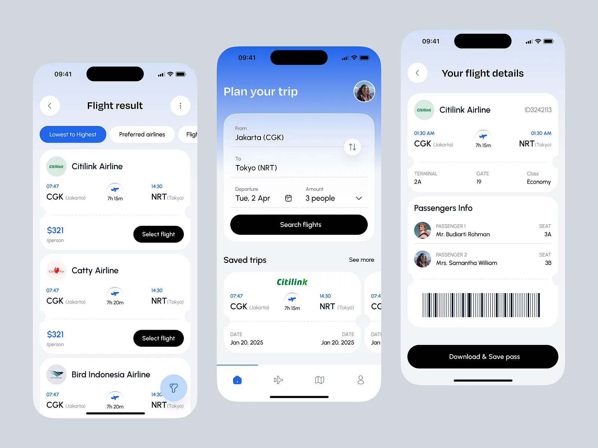

# Flight Booking App

A Flutter-based flight booking application with search, filtering, and boarding pass features. Built with Clean Architecture principles and Riverpod state management.

## Features

- **Flight Search**: Search flights by departure/arrival airports, date, and passengers
- **Advanced Filtering**: Filter by airline, price range, stops, and aircraft type
- **Sorting Options**: Sort by price, duration, or departure time
- **Infinite Scroll**: Paginated flight results with smooth infinite scrolling
- **Flight Details**: Comprehensive flight information with boarding pass view
- **Boarding Pass Export**: Save boarding pass to gallery or share
- **Offline Support**: Cached data available when offline with network status banner
- **Pull-to-Refresh**: Refresh data with pull gesture

## App Preview



---

## Steps to Run the Project

### Prerequisites

- Flutter SDK 3.38.2
- Dart SDK 3.8.0
- Android Studio / VS Code with Flutter extensions
- iOS Simulator (Mac) or Android Emulator

### Installation

1. **Clone the repository**
   ```bash
   git clone <repository-url>
   cd flight_booking_app
   ```

2. **Install dependencies**
   ```bash
   flutter pub get
   ```

3. **Generate code** (Freezed models, Riverpod providers, routes)
   ```bash
   dart run build_runner build --delete-conflicting-outputs
   ```

4. **Run the app**
   ```bash
   # For development
   flutter run

   # For specific environment
   flutter run --dart-define=ENV=dev      # Development
   flutter run --dart-define=ENV=staging  # Staging
   flutter run --dart-define=ENV=prod     # Production
   ```

### Running Tests

```bash
flutter test
```

### Static Analysis

```bash
flutter analyze
```

---

## Dependencies Used

### State Management
| Package | Version | Purpose |
|---------|---------|---------|
| `flutter_riverpod` | ^2.5.1 | State management with dependency injection |
| `riverpod_annotation` | ^2.3.5 | Code generation for Riverpod providers |

### Networking
| Package | Version | Purpose |
|---------|---------|---------|
| `dio` | ^5.4.1 | HTTP client for API requests |
| `dio_cache_interceptor` | ^3.5.0 | Response caching for offline support |
| `dio_cache_interceptor_hive_store` | ^3.2.2 | Persistent cache storage |
| `connectivity_plus` | ^5.0.2 | Network connectivity monitoring |

### Navigation
| Package | Version | Purpose |
|---------|---------|---------|
| `go_router` | ^13.2.1 | Declarative routing with type-safe routes |

### UI Components
| Package | Version | Purpose |
|---------|---------|---------|
| `cached_network_image` | ^3.3.1 | Image caching for airline logos |
| `flutter_svg` | ^2.0.9 | SVG rendering for barcodes |
| `shimmer` | ^3.0.0 | Loading skeleton animations |
| `intl` | ^0.20.2 | Date formatting |

### Data Models
| Package | Version | Purpose |
|---------|---------|---------|
| `freezed_annotation` | ^2.4.1 | Immutable data classes |
| `json_annotation` | ^4.8.1 | JSON serialization |
| `equatable` | ^2.0.7 | Value equality |

### Storage
| Package | Version | Purpose |
|---------|---------|---------|
| `shared_preferences` | ^2.2.3 | Key-value storage for preferences |
| `hive` | ^2.2.3 | NoSQL database for caching |
| `hive_flutter` | ^1.1.0 | Flutter integration for Hive |

### Export & Share
| Package | Version | Purpose |
|---------|---------|---------|
| `screenshot` | ^3.0.0 | Widget screenshot capture |
| `path_provider` | ^2.1.2 | File system paths |
| `share_plus` | ^9.0.0 | Share content with other apps |
| `permission_handler` | ^11.3.1 | Runtime permissions |
| `gal` | ^2.3.0 | Save images to gallery |

### Utilities
| Package | Version | Purpose |
|---------|---------|---------|
| `dartz` | ^0.10.1 | Functional programming (Either type for error handling) |

### Dev Dependencies
| Package | Version | Purpose |
|---------|---------|---------|
| `build_runner` | ^2.4.8 | Code generation runner |
| `json_serializable` | ^6.7.1 | JSON serialization code generation |
| `freezed` | ^2.4.7 | Immutable class code generation |
| `riverpod_generator` | ^2.4.0 | Riverpod provider code generation |
| `go_router_builder` | ^2.4.1 | Type-safe route code generation |

---

## Architecture & Approach

### Project Structure

The project follows **Feature-based Clean Architecture** with clear separation of concerns:

```
lib/
├── core/                    # Global utilities and configuration
│   ├── constants/           # App colors, API constants, strings
│   ├── network/             # Dio client, interceptors, cache config
│   ├── theme/               # App theme and typography
│   ├── error/               # Failure classes for error handling
│   ├── l10n/                # Localization strings
│   └── utils/               # Utility functions (date formatting, etc.)
│
├── features/                # Feature modules
│   ├── home/                # Home screen feature
│   │   ├── data/            # Data sources and repository implementations
│   │   ├── domain/          # Models and repository interfaces
│   │   └── presentation/    # Screens, widgets, and providers
│   │
│   ├── flight_search/       # Flight search and results feature
│   │   ├── data/
│   │   ├── domain/
│   │   └── presentation/
│   │
│   └── flight_details/      # Flight details and boarding pass feature
│       ├── data/
│       ├── domain/
│       └── presentation/
│
├── shared/                  # Shared components
│   ├── services/            # Connectivity, storage services
│   └── widgets/             # Reusable widgets (shimmer, buttons, etc.)
│
├── routes/                  # GoRouter configuration
├── app.dart                 # App widget with MaterialApp
└── main.dart                # Entry point
```

### Design Patterns Used

1. **Repository Pattern**: Abstracts data sources from business logic
2. **Either Pattern**: Functional error handling with `dartz` package
3. **Provider Pattern**: State management with Riverpod
4. **Dependency Injection**: Via Riverpod providers
5. **Factory Pattern**: Freezed-generated factory constructors

### Key Technical Decisions

#### State Management - Riverpod
- Chosen for its compile-time safety and code generation
- AsyncValue handles loading/error/data states elegantly
- Auto-dispose providers prevent memory leaks

#### Networking - Dio with Interceptors
- **Retry Interceptor**: Automatic retry with exponential backoff (3 retries)
- **Cache Interceptor**: Response caching with Hive storage
- **Deduplication Interceptor**: Prevents duplicate concurrent requests
- **Offline Queue Interceptor**: Queues failed requests for later
- **Logger Interceptor**: Debug logging for requests/responses

#### Data Models - Freezed
- Immutable data classes with `copyWith`
- Automatic JSON serialization
- Value equality out of the box

#### Error Handling
- `Either<Failure, T>` pattern for explicit error handling
- Typed failure classes (NetworkFailure, ServerFailure, etc.)
- Localized error messages

#### Offline Support
- API responses cached with configurable duration
- Custom cache keys include POST body for unique caching
- Network status banner when offline
- Prefetch critical data on app launch

### Thought Process

1. **Started with Clean Architecture**: Established clear boundaries between layers to ensure testability and maintainability.

2. **API-First Approach**: Analyzed the API documentation to design data models and repository interfaces before implementation.

3. **Incremental Feature Development**: Built features incrementally:
   - Phase 1: Core setup (networking, models, navigation)
   - Phase 2: Home screen with search card
   - Phase 3: Flight search with filters
   - Phase 4: Flight details and boarding pass
   - Phase 5: Polish (animations, offline support, caching)

4. **Performance Considerations**:
   - Implemented infinite scroll instead of loading all data
   - Added image caching for airline logos
   - Used shimmer loading for better perceived performance
   - Prefetch airports for faster dropdown loading

5. **Offline-First Thinking**: Designed caching strategy early to ensure good offline experience.

6. **User Experience Focus**:
   - Pull-to-refresh for manual data refresh
   - Active filter chips to show applied filters
   - Smooth animations and transitions
   - Clear error states with retry options

---

## API Integration

### Base URL
```
https://flight.wigian.in/flight_api.php
```

### Endpoints Implemented

| Endpoint | Purpose |
|----------|---------|
| `POST /search` | Search flights with filters and sorting |
| `POST /flight` | Get flight details by ID |
| `POST /airports/from` | Get departure airports |
| `POST /airports/to` | Get arrival airports |
| `POST /airlines` | Get airlines list |
| `POST /aircraft-types` | Get aircraft types |

---

## Time Taken

| Phase | Description | Approximate Hours |
|-------|-------------|-------------------|
| **Phase 1** | Project setup, architecture, core modules | 2-3 hours |
| **Phase 2** | Home screen, search card, airport selection | 3-4 hours |
| **Phase 3** | Flight search, results, filtering, sorting | 4-5 hours |
| **Phase 4** | Flight details, boarding pass, barcode | 3-4 hours |
| **Phase 5** | Caching, offline support, polish | 3-4 hours |
| **Phase 6** | Bug fixes, testing, documentation | 2-3 hours |
| **Total** | | **~18-23 hours** |

---

## License

This project is for assessment purposes.